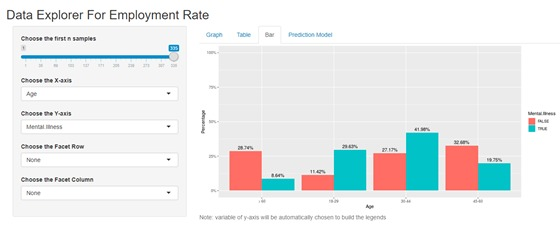
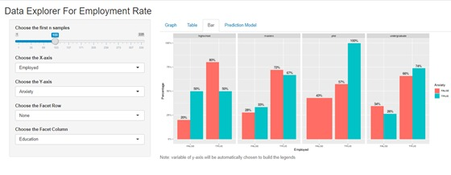
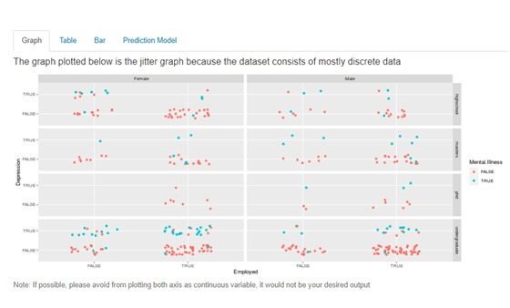

---
output:
  html_document: default
  word_document: default
---

## Data Report Markdown

Group 5

- Ong Heng Kiat (17205923/1)
- Gan Joo Han (17206504/1)
- Mohammad Afif Bin Mohammad Fauzi (17197449/2)
- Nurul Asyiqin binti Mohd Harmizi (17065343/2)
- Muhammad Iqmal Hafiy Bin Hamdi (17077341/2)

### Introduction 

Rapidly rising unemployment and an extremely low demand for labour are fundamental labour market problems currently facing all countries. Previous research has shown that the unemployment experience increases the risk of suffering from negative psychological outcomes, although, the effect appears to differ depending on life situation and individual characteristics. This heterogeneous effect of unemployment on mental health raises the question whether the labour market context, in the form of the local unemployment rate or vacancy rate, could mediate the effect in a similar manner. Such an effect of labour market conditions on the effect of unemployment on mental health, where the context affects the health effect, could be called, using Greenland and Morgenstern’s term, ecological effect modification.

### Problem Statement

What are the factors that will affect the employment rate? How much do these factors affect it? Why these factors can affect the employment rate so much?

### Data Acquisition

For this assignment, we will be implementing all the knowledge that we have learned to produce valuable insights using R, from data acquisition to building a simple web app using Shiny.

The data set we choose to be used for our question is a data set that is obtained through a paid research survey to explore the linkage between the mental illness and unemployment rate. 

The data set has a sample size of 354 and 31 variables. Beside mental illness there are also lots of other useful features that may be the factors affecting employment rate such as the **education level**, **gender**, **age**, **body condition** and so on. 

```{r}
library("openxlsx")
#Set working directory
setwd("C:/Users/user/Documents/R/Employment_Rate_Analysis_WebApp")
```

However, there is a fly in the ointment which the data set is not a cleaned data set. It has duplicate observations, syntax error, not standardized format, missing records and so on which require some time to clean it. The data set is in the format of xlsx excel file.

### Data Extraction and Cleaning

We will extract several useful features like **salary**, **age**, **position**, **education level** and so on from the data set acquired into a form that is easier for further processing and analysis.

```{r}
#Read the data sets into Rstudio
data <- read.xlsx("data/raw_dataset.xlsx")

#Analysis the data
View(data)
class(data) #check type of class 
dim(data) #check row & column
str(data) #Check the structure of the data sets
summary(data)
```

Then, we transform the data into a more beautiful data in such a way that it would be easier to be managed and also analyzed. This process includes detecting and correcting or removing the unwanted records such as duplicate records and inaccurate records.

```{r}
###Cleaning process
#Convert Data Type 
data$NA.<- NULL  #remove entire column 1
data$Employed <- as.logical(as.integer(as.character(data$Employed)))
data$Mental.Illness <- as.logical(as.integer(as.character(data$Mental.Illness)))
data$Education <- as.character(data$Education)
data$Have.Computer <- as.logical(as.integer(as.character(data$Have.Computer)))
data$Legally.Disabled <- as.logical(as.integer(as.character(data$Legally.Disabled)))
data$Internet.Access <- as.logical(as.integer(as.character(data$Internet.Access)))
data$Live.With.Parents <- as.logical(as.integer(as.character(data$Live.With.Parents)))
data$Study <- as.logical(as.integer(as.character(data$Study)))
data$Received.Food.Stamps <- as.logical(data$Received.Food.Stamps)
data$Section.8.Housing <- as.logical(data$Section.8.Housing)
data$Lack.of.concentration <- as.logical(data$Lack.of.concentration)
data$Anxiety <- as.logical(as.integer(as.character(data$Anxiety)))
data$Depression <- as.logical(data$Depression)
data$Obsessive.thinking <- as.logical(data$Obsessive.thinking)
data$Mood.swings <- as.logical(data$Mood.swings)
data$Panic.attacks <- as.logical(data$Panic.attacks)
data$Compulsive.behavior <- as.logical(data$Compulsive.behavior)
data$Tiredness <- as.logical(as.integer(as.character(data$Tiredness)))

#convert data type
data$Age <- as.character(data$Age)
data$Gender <- as.character(data$Gender)
data$Household.Income <- as.character(data$Household.Income)
data$Region <- as.character(data$Region)
data$Device.Type <- as.character(data$Device.Type)

# Remove duplicate data rows
data <- unique(data)

#Make all lowercase in variable Education
data$Education <- tolower(data$Education)

```

Next, we will remove all the rows that have the null values (which is denoted by "na"), so that the data we get more refined and cleaned. We also remove any columns that is unnecessary to what we're looking for.

```{r}
###Replacing Na / Null value

#Check number of null data before removing
sum(is.na(data))

#Method 1
#Replace all null value with Mode by referring to summary()
summary(data)
data$Have.Computer[is.na(data$Have.Computer)] <- TRUE
data$Legally.Disabled[is.na(data$Legally.Disabled)] <- FALSE
data$Internet.Access[is.na(data$Internet.Access)] <- TRUE
data$Live.With.Parents[is.na(data$Live.With.Parents)] <- FALSE
data$Anxiety[is.na(data$Anxiety)]<-FALSE
data$Tiredness[is.na(data$Tiredness)] <- FALSE

#Method 2
#Simply delete column with null value 
#data <- na.omit(data) 

#Check number of null data after removing
sum(is.na(data))

#Analysis the data
str(data)
dim(data) 
summary(data)

#List the name of column
colnames(data) 

```


Finally, we renamed the columns so that it is readable for users to understand.

```{r}
#Renaming column

names(data)[names(data) == "Mental.Illness" ] <- "Mental Illness"
names(data)[names(data) == "Education" ] <- "Education"
names(data)[names(data) == "Have.Computer" ] <- "Own Computer"
names(data)[names(data) == "I.have.been.hospitalized.before.for.my.mental.illness" ] <- "Hospitalized"
names(data)[names(data) == "Days.Hopitalized.for.Mental.illeness" ] <- "Days Hospitalized for Mental Illness"
names(data)[names(data) == "Legally.Disabled" ] <- "Disabled"
names(data)[names(data) == "Internet.Access" ] <- "Internet Access"
names(data)[names(data) == "Live.With.Parents" ] <- "Live With Parents"
names(data)[names(data) == "I.have.a.gap.in.my.resume" ] <- "GapInResume"
names(data)[names(data) == "Gap.In.Resume..Months." ] <- "Gaps In Resume(in a Month)"
names(data)[names(data) == "Total.Annual.Income..USD." ] <- "Annual Income (USD)"
names(data)[names(data) == "Annual.income.from.social.welfare.programs" ] <- "Annual Income from Social Welfare programs (USD)"
names(data)[names(data) == "Received.Food.Stamps" ] <- "Receive Food Stamps"
names(data)[names(data) == "Section.8.Housing" ] <- "Section 8 Housing"
names(data)[names(data) == "Frequency.Hospitalized" ] <- "Frequency Hospitalized"
names(data)[names(data) == "Lack.of.concentration" ] <- "Lack of Concentration"
names(data)[names(data) == "Obsessive.thinking" ] <- "Obsessive Thinking"
names(data)[names(data) == "Mood.swings" ] <- "Mood Swings"
names(data)[names(data) == "Panic.attacks" ] <- "Panic Attacks"
names(data)[names(data) == "Compulsive.behavior" ] <- "Compulsive Behavior"
names(data)[names(data) == "Household.Income" ] <- "Household Income"
names(data)[names(data) == "Device.Type" ] <- "Device Type"

#Write new datasets (after cleaning) to new xlsx file
write.xlsx(data,"data/CleanedData.xlsx",sheetName = "Sheet1" , col.names = TRUE, row.names = TRUE, append = FALSE, showNA = TRUE)

```


### Data Analysis

Now, we can visualize and analyze the data with various tools like R, and develop an algorithm to track the trends and the relationships between the features of the data.

```{r Analysis.R Code 1}
#read the file
mydata <- read.xlsx("data/CleanedData.xlsx")
print(str(mydata))

#change the type into factor type
mydata$Employed <- as.factor(mydata$Employed)
mydata$Mental.Illness <- as.factor(mydata$Mental.Illness)
mydata$Own.Computer <- as.factor(mydata$Own.Computer)
mydata$Disabled <- as.factor(mydata$Disabled)
mydata$Internet.Access <- as.factor(mydata$Internet.Access)
mydata$Live.With.Parents <- as.factor(mydata$Live.With.Parents)
mydata$Study <- as.factor(mydata$Study)
mydata$Receive.Food.Stamps <- as.factor(mydata$Receive.Food.Stamps)
mydata$Section.8.Housing <- as.factor(mydata$Section.8.Housing)
mydata$Lack.of.Concentration <- as.factor(mydata$Lack.of.Concentration)
mydata$Anxiety <- as.factor(mydata$Anxiety)
mydata$Depression <- as.factor(mydata$Depression)
mydata$Obsessive.Thinking <- as.factor(mydata$Obsessive.Thinking)
mydata$Mood.Swings <- as.factor(mydata$Mood.Swings)
mydata$Panic.Attacks <- as.factor(mydata$Panic.Attacks)
mydata$Compulsive.Behavior <- as.factor(mydata$Compulsive.Behavior)
mydata$Tiredness <- as.factor(mydata$Tiredness)
mydata$Gender <- as.factor(mydata$Gender)
mydata$Education<- as.factor(mydata$Education)
mydata$Age<- as.factor(mydata$Age)
mydata$Household.Income<- as.factor(mydata$Household.Income)
mydata$Device.Type<- as.factor(mydata$Device.Type)
print(str(mydata))

```

From the code above, the **as.factor()** in R is used to convert the data type of a variable to a factor/categorical variable. Now, we want to check if there is null values in the data frame.

```{r Analysis.R Code 2}
nrow(mydata[is.na(mydata$Study)|is.na(mydata$Depression)] )

mydata[is.na(mydata$Study)|is.na(mydata$Depression),]
nrow(mydata)

xtabs(~ Employed + Study, data=mydata)       

unique(mydata$Education)
unique(mydata$Employed)
```

We will be split the data obtained to 2 parts:

- the training set, to train the model
- the test set, to test the model

We will be using the regression model to do prediction and produce values for analysis. We will use the **glm()** command to run logistic regression with **train_set** table,and after the comma, we specify that the distribution is binomial.

We can access the model output using **summary()**.

```{r Analysis.R Code 3, eval  = FALSE, include= FALSE}
# simply choose a seed so that the performance of the model would be more stable
set.seed(10) 

#split the train and test set with 80% and 20% proportion
split_index <- sample(2,nrow(mydata),replace = T , prob = c(0.8,0.2))
train_set <- mydata[split_index == 1,]
test_set <- mydata[split_index == 2,]

#build the regression function to predict output with certain variables that are most significant
regression_function <- Employed ~ .

#build the model using the function and train set
#binomial is used as family because it is classification problem
logistic_model <- glm(regression_function , data = train_set, family ='binomial')
summary(logistic_model)

regression <- Employed ~  Internet.Access + `Gaps.In.Resume(in.a.Month)` + Age + Disabled + Mental.Illness
logistic_model <- glm(regression , data = train_set, family ='binomial')
summary(logistic_model)

#get the probability to predict the train data
train_predict <- predict(logistic_model, train_set, type = 'response')
#If probability higher than 0.5 than it is 1 which means employed, and vice versa
train_predict <- ifelse(train_predict >=0.5 , "TRUE" , "FALSE")
train_matrix <- table(Prediction = train_predict , Actual = train_set$Employed)
train_accuracy <- sum(train_predict == train_set$Employed)/nrow(train_set)*100

#same goes to test set data
#the existence of the test data is to determine whether the model is overfitting, underfitting or just okay.
test_predict <- predict(logistic_model, test_set, type = 'response')
test_predict <- ifelse(test_predict >=0.5 ,  "TRUE" , "FALSE")
test_matrix <- table(Prediction = test_predict , Actual = test_set$Employed)
test_accuracy <- sum(test_predict == test_set$Employed)/nrow(test_set)*100

#Display the results
print(train_matrix)
print(train_accuracy)
print(test_matrix)
print(test_accuracy)
```

After we run the code, we can see the summary of the **logistic_model**, the **train_matrix**, **train_accuracy**, **test_matrix** and **test_accuracy**. 

If we run the this chunk few times, we noticed that the values of train_accuracy and test_accuracy differs on each run. It is normal because the initial weight is randomly generated. 

To get the same accuracy on each run, we use **set.seed()** function to set the starting number used to generate a sequence of random numbers. It ensures that we can get the same result if you start with that same seed each time you run the same process.


### Data Visualization using Shiny Web App

Using the web app, we can see many graphs and charts appeared, show us the correlation between all the factors that can be connected to the unemployment rate. 

The link for the app :

https://onghengkiat.shinyapps.io/employment_rate_analysis_webapp/

After you open the link, you can see the Data Explorer For Employment Rate. We can do some correlation between the data we seek based on the graphs, table, bar and prediction model.

```{r  App.R Code, eval=FALSE, include=FALSE}
library(shiny)
library(ggplot2)
library(xlsx)
library(rsconnect)
library(shinyjs)

#set up the account info
rsconnect::setAccountInfo(name='onghengkiat',
                          token='AA5C3516E0990B59FB0F66B865EA1958',
                          secret='+eQXsKOs/8qelgATciTXu/U18dAfVCS/uQicOPSo')

#reads the data
dataset <- read.xlsx("data/cleanedData.xlsx",sheetIndex=1,header=TRUE)

#simply choose a seed so that the performance of the model would be more stable
set.seed(10)  

#split the train and test set with 80% and 20% proportion
split_index <- sample(2,nrow(dataset),replace = T , prob = c(0.8,0.2))
train_set <- dataset[split_index == 1,]
test_set <- dataset[split_index == 2,]
  
#build the regression function to predict output with certain variables that are most significant 
regression_function <- Employed ~ Disabled + Internet.Access+ Receive.Food.Stamps+
  Anxiety + Age + Household.Income  

#build the model using the function and train set
#binomial is used as family because it is classification problem
logistic_model <- glm(regression_function , data = train_set, family ='binomial')

#get the probability to predict the train data
train_predict <- predict(logistic_model, train_set, type = 'response')

#If probability higher than 0.5 than it is 1 which means employed, and vice versa
train_predict <- ifelse(train_predict >=0.5 , TRUE , FALSE)

#same goes to test set data
#the existence of the test data is to determine whether the model is overfitting, underfitting or just okay.
test_predict <- predict(logistic_model, test_set, type = 'response')
test_predict <- ifelse(test_predict >=0.5 , TRUE , FALSE)
paste(format(round(sum(test_predict == test_set$Employed)/nrow(test_set)*100),nsmall=2),"%")
paste(format(round(sum(train_predict == train_set$Employed)/nrow(train_set)*100),nsmall=2),"%")

ui <- fluidPage(
  #set up the shiny js
  useShinyjs(),
  titlePanel("Data Explorer For Employment Rate"),
  
  sidebarPanel(
    sliderInput(inputId='sampleSize', label='Choose the first n samples', min=1, max=nrow(dataset),
                value=nrow(dataset), step=1),
    selectInput(inputId='xaxis', label='Choose the X-axis', choices=names(dataset), selected=names(dataset)[[1]]),
    selectInput(inputId='yaxis', label='Choose the Y-axis', choices=names(dataset), selected=names(dataset)[[2]]),
    
    #put none as "." but still shown as none in the selection for syntax use in building facet grid later
    selectInput(inputId='facet_row', label='Choose the Facet Row', choices=c(None='.', names(dataset))), 
    selectInput(inputId='facet_col', label='Choose the Facet Column', choices=c(None='.', names(dataset))),
    
    selectInput(inputId='legend', label='Legend', choices=c('None', names(dataset))),
    checkboxInput(inputId = 'selectAll',label = 'Show All Variables', value = FALSE),
    
    checkboxGroupInput(inputId = 'modelCheckbox',label='Select the one which is/are TRUE',
      choiceNames=c('Legally Disable','Internet Access','Received Food Stamps','Anxiety'),
      choiceValues= c('Legally Disable','Internet Access','Received Food Stamps','Anxiety')
    ),
    selectInput(inputId ='age', label ='Age', choices = levels(dataset$Age)),
    selectInput(inputId = 'income', label = 'Household Income', choices = levels(dataset$Household.Income))
  ),
  
  mainPanel(
    
    tabsetPanel( id = 'tabsetPanel', selected = 'Graph',
                 
      tabPanel(h4("The graph plotted below is the jitter graph because the dataset consists of mostly discrete data"),
               title = "Graph", plotOutput("graph"),
               helpText("Note: If possible, please avoid from plotting both axis as continuous variable, it would not be your desired output")),
      
      tabPanel(title = "Table", tableOutput("table")),
      
      tabPanel(title = "Bar", plotOutput("bar"),
               helpText("Note: variable of y-axis will be automatically chosen to build the legends")),
      
      tabPanel(title = "Prediction Model", h3("Accuracy of the Model"),
               h4("The accuracy for the train set(%):"), verbatimTextOutput("trainAccuracy"),tableOutput("trainConfusion"),
               h4("The accuracy for the test set(%):"),verbatimTextOutput("testAccuracy"),tableOutput("testConfusion"),
               h4("The predicted output is shown below:"),verbatimTextOutput("predictOutput"))
    )
  )
)

server <- function(input, output) {
  
  #extract certain portion of the data from whole data sets
  data_shown <- reactive({
    dataset[1:input$sampleSize,]
  })
  
  #get the tabselected so that we can specifically show and hide certain input box in the sidebar panel
  tabselected <- reactive ({
    input$tabsetPanel
  })
  
  #get the facet row
  facet_row <- reactive({
    
    #it cannot be same with facet column, if it is, an error message will be shown
    validate(
      need((input$facet_row != input$facet_col ) || input$facet_row == '.', "Please choose value different with facet column for facet row")
    )
    input$facet_row
  })
  
  #get the facet column
  facet_column <- reactive({
    #it cannot be same with facet row, if it is, an error message will be shown
    validate(
      need((input$facet_col != input$facet_row) || input$facet_col == '.', "Please choose value different with facet row for facet column")
    )
    input$facet_col
  })
  
  output$graph <- renderPlot({
    
    a#show and hide some control widgets
    if(tabselected() == 'Graph'){
      show('sampleSize')
      show('xaxis')
      show('yaxis')
      show('facet_row')
      show('facet_col')
      hide('selectAll')
      show('legend')
      hide('modelCheckbox')
      hide('age')
      hide('income')
      hide('rebuild')
      hide('submit')
    }
    
    #plot the graph with jitter plot because most of the varaibles are nominal data
    #Thus jitter plot is the one that most suit with it
    #width and height is the range of the points scatter around
    p <- ggplot(data_shown(), aes_string(x=input$xaxis, y=input$yaxis)) +
      geom_jitter(width = 0.25, height = 0.25)
   
    if (input$legend != 'None')
      p <- p + aes_string(color=input$legend) +
        scale_fill_discrete(name = "Legends")
    
    facets <- paste(facet_row(), '~', facet_column())
    if (facets != '. ~ .')
      p <- p + facet_grid(facets)
    
    #show the graph
    p
    
  })
  
  output$table <- renderTable({
    if(tabselected() == 'Table'){
      show('sampleSize')
      show('xaxis')
      show('yaxis')
      show('facet_row')
      show('facet_col')
      hide('legend')
      show('selectAll')
      hide('modelCheckbox')
      hide('age')
      hide('income')
      hide('rebuild')
      hide('submit')
    }
    
    #if user chooses to show all variable
    if (input$selectAll == TRUE){
      #just simply show the data 
      data_shown()
    }else{
      
      #else, get the xaxis,yaxis,facet row and facet column
      selected = c(input$xaxis,input$yaxis)
      
      # . means none for facet_row input, so if it is none, ignore it
      if (input$facet_row != '.'){
        #else, appends it to the selected vector
        selected = c(selected,facet_row())
      }
      
      #same trick with facet_row
      if (input$facet_col != '.')
        selected = c(selected,facet_column())
      
      #same trick with facet_row and column but just that none is none for legend input
      if (input$legend != 'None')
        selected = c(selected,input$legend)
  
      #show the table
      a <- subset(data_shown(), select = unique(selected))
      a
    }
  })
  
  output$bar <- renderPlot({
    if(tabselected() == 'Bar'){
      show('sampleSize')
      show('xaxis')
      show('yaxis')
      show('facet_row')
      show('facet_col')
      hide('legend')
      hide('selectAll')
      hide('modelCheckbox')
      hide('age')
      hide('income')
      hide('rebuild')
      hide('submit')
    }
    
    #position = dodge means that the group of bars will be side by side
    #by default it is stack, means that the group of bars will stack on each other
    #y = ..prop.. means it is count divided by sum of all count that belongs to same group
    #label = scales::percent is making it to become percentange to be shown as labels
    #limits = c(0,1) is making the y-axis labels to show from 0.00 to 1.00 which converts to percentage are 0% to 100%
    #vjust = -.5 makes the label text like 69.7% to be shown above the bar for each group
    gg <- ggplot(data_shown(), aes_string(x=input$xaxis, group=input$yaxis, fill= input$yaxis)) +
      geom_bar(aes(y=..prop..),position="dodge")+
      scale_y_continuous(limits = c(0,1),name = 'Percentage', labels = scales::percent)+
      geom_text(aes(label = scales::percent(..prop..), y=..prop..), 
                stat="count", vjust=-.5,position=position_dodge(0.9))
 
    
    facets <- paste(facet_row(), '~', facet_column())
    if (facets != '. ~ .')
      gg <- gg + facet_grid(facets)
    
    #show the bar
    gg
  })
 
  
  output$trainAccuracy <- renderText({
    if(tabselected() == 'Prediction Model'){
      hide('sampleSize')
      hide('xaxis')
      hide('yaxis')
      hide('facet_row')
      hide('facet_col')
      hide('selectAll')
      hide('legend')
      show('modelCheckbox')
      show('age')
      show('income')
      show('rebuild')
      show('submit')
    }
    
    #format(), nsmall = 2 is making it to become 2 decimal places only
    #this is calculating the accuracy of model on predicting train set in percentage
    paste(format(round(sum(train_predict == train_set$Employed)/nrow(train_set)*100),nsmall=2),"%")
  })
  
  output$trainConfusion <- renderTable({
    #makes a confusion matrix on train set
    #it displays the number of true positive, false positive, true negative and false negative
    table(Prediction = train_predict , Actual = train_set$Employed)
  })
  
  #calculate accuracy of model on predicting test set in percentage
  output$testAccuracy <- renderText({
    paste(format(round(sum(test_predict == test_set$Employed)/nrow(test_set)*100),nsmall=2),"%")
  })
  
  output$testConfusion <- renderTable({
    #makes a confusion matrix on test set
    #it displays the number of true positive, false positive, true negative and false negative
    table(Prediction = test_predict , Actual = test_set$Employed)
  })
  
  
  output$predictOutput <- renderText({
    
    #create a dataframe for the model to predict output
    #these are the default values of the dataframe
    input_data <- data.frame(
      Disabled = factor("FALSE", levels = levels(dataset$Disabled)),
      Internet.Access = factor("FALSE", levels = levels(dataset$Internet.Access)),
      Receive.Food.Stamps = factor("FALSE", levels = levels(dataset$Receive.Food.Stamps)),
      Anxiety = factor("FALSE", levels = levels(dataset$Anxiety)),
      Age = input$age,
      Household.Income = input$income
    )
    
    #check is any one or more than one of the check box in the check box group is selected
    #if it is, then update the value in the dataframe
    # "str" %in% vector means that "str" is inside the vector
    # so if it is TRUE, then means the variable's value is TRUE, update the dataframe
    if(length(input$modelCheckbox) > 0){
      if("Legally Disable" %in% input$modelCheckbox){
        input_data$Disabled = "TRUE"
      }
      if("Internet Access" %in% input$modelCheckbox){
        input_data$Internet.Access = "TRUE"
      }
      if("Received Food Stamps" %in% input$modelCheckbox){
        input_data$Receive.Food.Stamps = "TRUE"
      }
      if("Anxiety" %in% input$modelCheckbox){
        input_data$Anxiety = "TRUE"
      }
    }
    
    #predict on the input
    prediction <- predict(logistic_model, input_data, type = 'response')
    
    #if the probability more than or equals to 0.5, it is employed
    #else, it is unemployed
    prediction <- ifelse(prediction >=0.5 , "Congratulation, the result is employed!" , "Sadly, it looks like would be unemployed")
    
    #show the result of the prediction
    prediction
  })
}

#run the shiny app
shinyApp(ui = ui, server=server)

```

Here are some of the data obtained from observation.

```{r echo= FALSE}

```

From the image above, we are trying to look for linkage between age and mental illness. There is an increase of mental illness from age 18 to 44 years old, and the bars began to drop at the age of 45 to more than age 60. About 29.63% of people in age 18-29 suffered with mental illness. It is due to the fact that this age group has started to further their studies and looking for the any job vacancies, ready to be employed. It showed the highest peak of mental illness at the age between 30 to 44 years old. It is because of the work pressures and mid-life crisis.

```{r echo= FALSE}

```

Now, we checked on the correlation between the employment and anxiety, separated by education and using only 100 samples. Please be noted that the 'FALSE' part is for people who are currently in their studies while the 'TRUE' part represents people that already completed their studies. 

We can see that most of the Completed undergraduate students and Completed PhD students that already employed to their respective jobs said that anxiety are happened in their workplace. It is because that people cannot foresee all the obstacles they might encounter in their work, which affects attention and concentration.

We can see from scatter plots at the graph charts below, with all the samples, people that is employed and suffered mental illness is the more likely to be the completed undergraduate students. It is found that women is likely to get mental health problems such as depression than men.

```{r echo= FALSE}

```

### Conclusion

As we all know, mental health problems has become such a serious issue in 21st century, especially among youngsters and adults. We demonstrate that data science can be applied to find the factors  that affect the employment rate . From the analysis and factors that we obtained, we can find the linkage between the employment rate and the mental illness. Although the prediction might be not  accurate, we can still fix the problem with other approaches. The model need be trained with more data so that we can make the better accuracy for us to predict the outcome for data scientists to produce data insights, but there is much more to be done now and in the future. 


